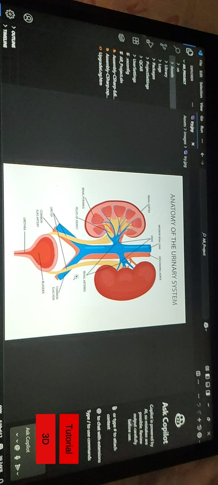
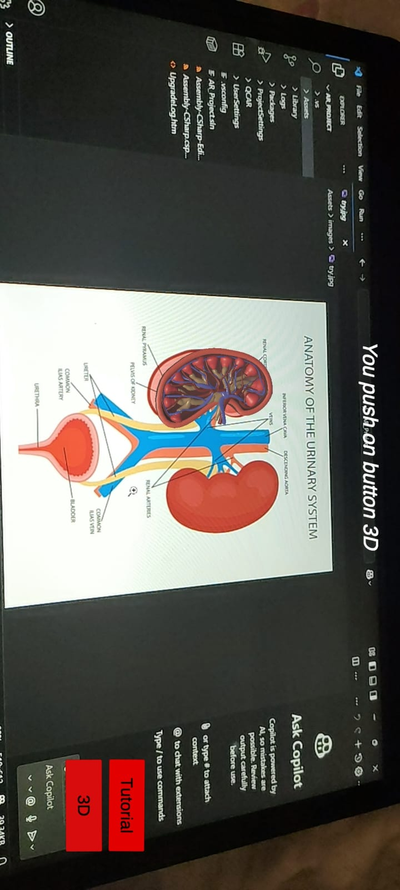
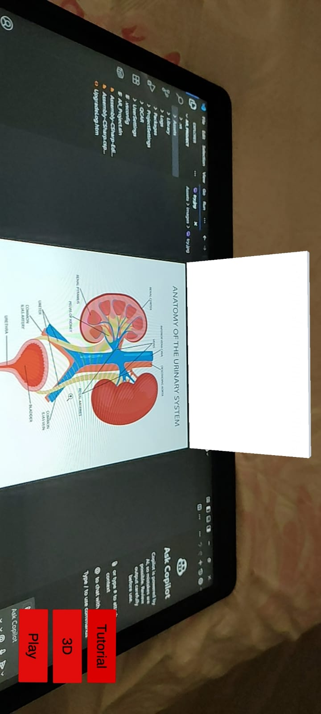
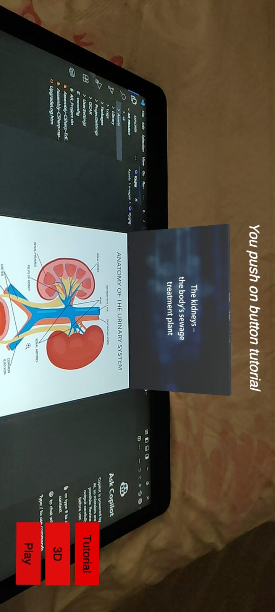

# 📱 AR_Kidney_Project

This is an **Augmented Reality (AR)** application built using Unity and Vuforia that visualizes a **3D kidney model** when a specific image is detected. It includes interactive buttons to **toggle a 3D kidney model** and **play an educational video** explaining its function.

---

## 🚀 Features

- 📸 Image-based tracking using **Vuforia**.
- 🧠 Displays a 3D **kidney model** when a target image is detected.
- 🎥 Plays an educational **video** explaining the kidney.
- 🎛️ User interface buttons to:
  - Show/Hide the 3D kidney.
  - Play/Pause the video.

---

## 🗂️ Project Structure

```
Assets/
├── characters/              # 3D models (e.g., kidney.fbx)
│   └── kidney.fbx
├── Editor/                  # Editor scripts or configurations
├── images/                  # Target image(s) for AR detection
├── matrial/                 # [NOTE: Likely a typo of "material"] contains material assets
├── Resources/               # Unity resources
├── Scenes/                  # Scene files for Unity
├── scripts/                 # C# scripts (video controller, buttons, etc.)
├── StreamingAssets/         # Video files stored for playback
├── videos/                  # Video references and textures
```

---

## 🔧 Requirements

- Unity 2020+ (recommended Unity 2021.3+)
- Vuforia Engine (installed via Unity Package Manager or Vuforia SDK)
- Android or iOS build support (for mobile deployment)

---

## 📸 How It Works

1. **Image Detection**:
   - The app uses Vuforia to detect a specific image placed in the `/images/` folder.

2. **3D Model Interaction**:
   - When the image is recognized, a 3D kidney model (in `/characters/kidney.fbx`) appears in AR space.

3. **Video Playback**:
   - A video explaining the kidney appears as a plane or texture when a button is pressed.

---

## 🧠 Scripts Description

- `VideoController.cs`: Manages video playback from the StreamingAssets folder.
- `ModelToggle.cs`: Toggles the visibility of the 3D model.
- `UIManager.cs`: Handles button clicks and updates.

---

## 📱 Build & Deploy

1. Open the project in Unity.
2. Set up Vuforia:
   - Add your Vuforia license key in **Project Settings > Vuforia Engine**.
   - Assign the image target in your scene.
3. Add Android/iOS support via Unity Hub.
4. Build and run on a physical device.

---

## 📝 Notes

- 📦 All assets (models, materials, images, videos) are stored under the `Assets/` directory.
- ⚠️ Folder name `matrial` should ideally be renamed to `materials` for clarity.
- 🎬 Video must be placed inside `StreamingAssets/` to be accessible on device.

---

## 🖼️ Screenshots

### 📱 In-App Screenshot

### 📱 In-App Screenshot

### 📱 In-App Screenshot

### 📱 In-App Screenshot


---

## 📄 License

This project is licensed under the MIT License — feel free to use, modify, and distribute.
